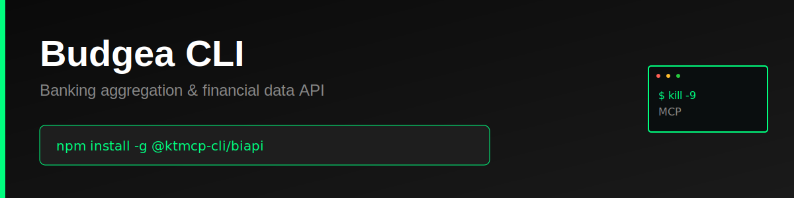

> "Six months ago, everyone was talking about MCPs. And I was like, screw MCPs. Every MCP would be better as a CLI."
>
> — [Peter Steinberger](https://twitter.com/steipete), Founder of OpenClaw
> [Watch on YouTube (~2:39:00)](https://www.youtube.com/@lexfridman) | [Lex Fridman Podcast #491](https://lexfridman.com/peter-steinberger/)

# Budgea CLI

Production-ready command-line interface for the [Budgea API](https://budgea.biapi.pro/) - Banking aggregation and financial data platform compliant with PSD2 regulations.

> **⚠️ Unofficial CLI** - This tool is not officially sponsored, endorsed, or maintained by Budgea or Budget Insight. It is an independent project built on the public Budgea API. API documentation: https://budgea.biapi.pro/2.0/doc/

## Features

- Complete coverage of Budgea API v2.0 endpoints
- Support for banking aggregation (accounts, transactions, balances)
- Bank transfer management (PSD2 payment initiation)
- User and connection management
- Authentication token handling
- Simple, intuitive command structure
- JSON and pretty-print output formats
- File-based and inline data input
- Comprehensive error handling
- Persistent configuration storage
- Progress indicators for long-running operations

## Why CLI > MCP

### The MCP Problem

Model Context Protocol (MCP) servers introduce unnecessary complexity and failure points for API access:

1. **Extra Infrastructure Layer**: MCP requires running a separate server process that sits between your AI agent and the API
2. **Cognitive Overhead**: Agents must learn MCP-specific tool schemas on top of the actual API semantics
3. **Debugging Nightmare**: When things fail, you're debugging three layers (AI → MCP → API) instead of two (AI → API)
4. **Limited Flexibility**: MCP servers often implement a subset of API features, forcing you to extend or work around limitations
5. **Maintenance Burden**: Every API change requires updating both the MCP server and documentation

### The CLI Advantage

A well-designed CLI is the superior abstraction for AI agents:

1. **Zero Runtime Dependencies**: No server process to start, monitor, or crash
2. **Direct API Access**: One hop from agent to API with transparent HTTP calls
3. **Human + AI Usable**: Same tool works perfectly for both developers and agents
4. **Self-Documenting**: Built-in `--help` text provides complete usage information
5. **Composable**: Standard I/O allows piping, scripting, and integration with other tools
6. **Better Errors**: Direct error messages from the API without translation layers
7. **Instant Debugging**: `--format json` gives you the exact API response for inspection

**Example Complexity Comparison:**

MCP approach:
```
AI Agent → MCP Tool Schema → MCP Server → HTTP Request → API → Response Chain (reverse)
```

CLI approach:
```
AI Agent → Shell Command → HTTP Request → API → Direct Response
```

The CLI is simpler, faster, more reliable, and easier to debug.

## Installation

```bash
npm install -g @ktmcp-cli/biapi
```

Or install locally:

```bash
cd biapi
npm install
npm link
```

## Configuration

### Set Access Token

Get your access token from your Budgea API provider.

```bash
biapi config set accessToken YOUR_ACCESS_TOKEN_HERE
```

### Environment Variables

Alternatively, use environment variables:

```bash
export BIAPI_ACCESS_TOKEN=your_token_here
export BIAPI_BASE_URL=https://demo.biapi.pro/2.0  # Optional
export BIAPI_CLIENT_ID=your_client_id             # Optional
export BIAPI_CLIENT_SECRET=your_client_secret     # Optional
```

### View Configuration

```bash
# Show all config
biapi config list

# Get specific value
biapi config get accessToken
```

## Usage

### Authentication

```bash
# Create temporary token (anonymous user)
biapi auth init

# Generate JWT token (requires client credentials)
biapi auth jwt --user-id 123

# Revoke current token
biapi auth revoke
```

### Banks

```bash
# List all available banks
biapi banks list --limit 50

# Get specific bank details with fields
biapi banks get 59 --expand fields

# Search for banks
biapi banks search "BNP"
```

### Users

```bash
# Get current user information
biapi users me --expand connections

# List all users (admin only)
biapi users list

# Delete current user
biapi users delete
```

### Connections

```bash
# List all bank connections
biapi connections list --expand accounts

# Get specific connection
biapi connections get 123 --expand accounts

# Create new connection
biapi connections create -f connection.json

# Update connection
biapi connections update 123 -f update.json

# Trigger sync
biapi connections sync 123

# Delete connection
biapi connections delete 123
```

### Accounts

```bash
# List all accounts
biapi accounts list

# Get specific account
biapi accounts get 456 --expand transactions

# Update account name
biapi accounts update 456 --name "My Checking"

# Delete account
biapi accounts delete 456
```

### Transactions

```bash
# List all transactions
biapi transactions list --limit 100

# List transactions for specific account
biapi transactions list --account 456 --limit 50

# Filter by date range
biapi transactions list \
  --min-date 2024-01-01 \
  --max-date 2024-12-31 \
  --expand category

# Get specific transaction
biapi transactions get 789

# Update transaction
biapi transactions update 789 --comment "Rent payment" --category 10

# Delete transaction
biapi transactions delete 789
```

### Transfers (PSD2)

```bash
# List all transfers
biapi transfers list

# Get specific transfer
biapi transfers get 101

# Create new transfer
biapi transfers create \
  --account 456 \
  --recipient 789 \
  --amount 100.00 \
  --label "Payment to John" \
  --exec-date 2024-12-31

# Execute pending transfer
biapi transfers execute 101 --password "123456"

# Cancel transfer
biapi transfers cancel 101
```

## Output Formats

All list and get commands support `--format` option:

```bash
# Pretty print (default)
biapi accounts list --format pretty

# JSON output for scripting
biapi accounts list --format json | jq '.accounts[0].balance'
```

## API Endpoints Covered

- **Authentication**: `/auth/init`, `/auth/jwt`, `/auth/token`
- **Users**: `/users/me`, `/users`
- **Banks**: `/banks`, `/banks/{id}`
- **Connections**: `/users/me/connections`
- **Accounts**: `/users/me/accounts`
- **Transactions**: `/users/me/transactions`
- **Transfers**: `/users/me/transfers`
- **Recipients**: `/users/me/accounts/{id}/recipients`

## Use Cases

### Personal Finance Management

Aggregate all your bank accounts and transactions in one place:

```bash
# Get all accounts with current balances
biapi accounts list --expand transactions

# Export last 3 months of transactions
biapi transactions list \
  --min-date 2024-10-01 \
  --max-date 2024-12-31 \
  --format json > transactions.json
```

### Open Banking Compliance

Build PSD2-compliant applications with account information and payment initiation:

```bash
# List available payment accounts
biapi accounts list

# Initiate a bank transfer
biapi transfers create \
  --account 123 \
  --recipient 456 \
  --amount 50.00 \
  --label "Invoice #12345"
```

### Financial Data Analysis

Export data for analysis and reporting:

```bash
# Get transaction data in JSON format
biapi transactions list --format json | \
  jq '[.transactions[] | {date, amount: .value, description: .wording}]'
```

### Multi-Bank Aggregation

Connect and sync multiple bank accounts:

```bash
# Add new bank connection
biapi connections create -f bank-connection.json

# Sync all connections
for id in $(biapi connections list --format json | jq -r '.connections[].id'); do
  biapi connections sync $id
done
```

## Error Handling

The CLI provides clear error messages:

```bash
$ biapi accounts get 999999
✖ Failed to fetch account
Error: Resource not found.
```

Common errors:
- `401`: Invalid or expired access token
- `403`: Insufficient permissions
- `404`: Resource not found
- `422`: Validation error
- `429`: Rate limit exceeded
- `500`: Internal server error
- `503`: Service unavailable

## Development

```bash
# Clone the repository
git clone https://github.com/ktmcp-cli/biapi.git
cd biapi

# Install dependencies
npm install

# Link for local development
npm link

# Run commands
biapi --help
```

## License

MIT License - see [LICENSE](LICENSE) file for details.

## Disclaimer

This is an unofficial CLI tool for the Budgea API. It is not affiliated with, endorsed by, or maintained by Budgea or Budget Insight. Use at your own risk.

## Contributing

Contributions are welcome! Please feel free to submit a Pull Request.

## Support

For issues and questions:
- GitHub Issues: https://github.com/ktmcp-cli/biapi/issues
- Budgea API Documentation: https://budgea.biapi.pro/2.0/doc/

## Related Projects

Part of the **Kill The MCP** project:
- Website: https://killthemcp.com
- GitHub Org: https://github.com/ktmcp-cli

Other KTMCP CLIs:
- [Billingo CLI](https://github.com/ktmcp-cli/billingo) - Hungarian invoicing
- [Klarna CLI](https://github.com/ktmcp-cli/klarna) - Buy now, pay later
- [NOWPayments CLI](https://github.com/ktmcp-cli/nowpayments) - Crypto payments
- [Nordigen CLI](https://github.com/ktmcp-cli/nordigen) - Open banking
- [Codat CLI](https://github.com/ktmcp-cli/codat) - Accounting integration


---

## Support KTMCP

If you find this CLI useful, we'd greatly appreciate your support! Share your experience on:
- Reddit
- Twitter/X
- Hacker News

**Incentive:** Users who can demonstrate that their support/advocacy helped advance KTMCP will have their feature requests and issues prioritized.

Just be mindful - these are real accounts and real communities. Authentic mentions and genuine recommendations go a long way!

## Support This Project

If you find this CLI useful, we'd appreciate support across Reddit, Twitter, Hacker News, or Moltbook. Please be mindful - these are real community accounts. Contributors who can demonstrate their support helped advance KTMCP will have their PRs and feature requests prioritized.
